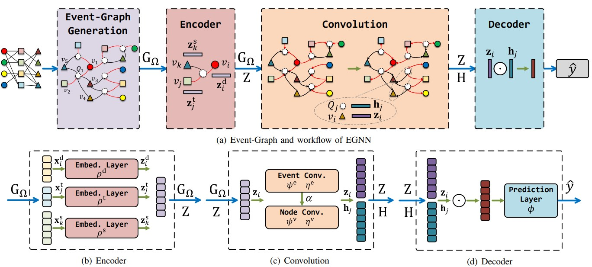

# Understanding Multivariate Drug-Target-Disease Interdependence via Event-Graph

This repository is the implementation of the paper: 

Qu Jingwei, Wang Bei, Zhixun Li, Xiaoqing Lyu, and Zhi Tang. [Understanding Multivariate Drug-Target-DiseaseInterdependence via Event-Graph](https://ieeexplore.ieee.org/abstract/document/9669683/) *(BIBM2021)*

# Requirement
```
- python
- torch
- rdkit
- Bio
- pyMeSHSim
```

# Dataset
The data set used in this paper is collected from [Stanford Biomedical Network Dataset Collection](https://snap.stanford.edu/biodata/index.html). You can the drug-target, drug-drug, drug-disease, disease-target, disease-disease relationships from this website.

# How to use
```
sh run.sh
```
# How to cite

If you use EGNN in an academic publication, cite as:
```
@INPROCEEDINGS{9669683,
  author={Qu, Jingwei and Wang, Bei and Li, Zhixun and Lyu, Xiaoqing and Tang, Zhi},
  booktitle={2021 IEEE International Conference on Bioinformatics and Biomedicine (BIBM)}, 
  title={Understanding Multivariate Drug-Target-DiseaseInterdependence via Event-Graph}, 
  year={2021},
  volume={},
  number={},
  pages={1685-1687},
  doi={10.1109/BIBM52615.2021.9669683}}

```
